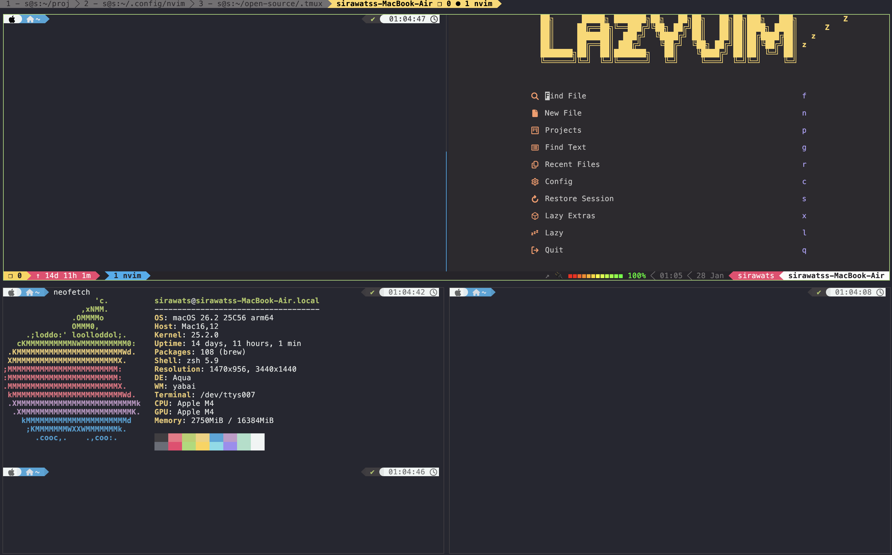

# dotfiles

Personal macOS / Linux dotfiles

## Table of Contents
- [Preview](#preview)
- [Prerequisites](#prerequisites)
- [Installation](#installation)
  - [Terminal](#terminal)
  - [Neovim](#neovim)
  - [tmux](#tmux)
  - [CLI Scripts](#cli-scripts)
  - [macOS](#macos)
- [Troubleshooting](#troubleshooting)

## Preview



## Prerequisites

- macOS or Linux
- Git
- curl
- **macOS:** [Homebrew](https://brew.sh/)
- **Linux:** apt or equivalent package manager

## Install

```bash
git clone https://github.com/sirawats/dotfiles.git ~/dotfiles
```

## Installation

### Terminal

- **Emulator:**  [kitty](https://sw.kovidgoyal.net/kitty/)
  ```bash
  # macos/linux
  curl -L https://sw.kovidgoyal.net/kitty/installer.sh | sh /dev/stdin
  ```
  - **Configuration:**
    ```bash
    cd ~/.config/kitty
    
    # Settings
    curl -L https://raw.githubusercontent.com/sirawats/dotfiles/refs/heads/master/kitty/kitty.conf -o kitty.conf

    # Color Scheme
    curl -L https://raw.githubusercontent.com/sirawats/dotfiles/refs/heads/master/kitty/moondrop.conf -o moondrop.conf
    ```
  
- **Shell:** [zsh](https://github.com/ohmyzsh/ohmyzsh/wiki/Installing-ZSH)
  ```bash
  brew install zsh # macOS
  chsh -s $(which zsh) # change default shell
  sudo pacman -S zsh # arch linux
  apt install zsh # debian/ubuntu
  ```

  - **Quick Install** (Oh-My-Zsh + plugins + theme + dotfiles):
    ```bash
    bash ~/dotfiles/zsh/install.sh
    ```

  - **What's included:**
    - **Framework:** [oh-my-zsh](https://github.com/ohmyzsh/ohmyzsh)
    - **Theme:** [Powerlevel10k](https://github.com/romkatv/powerlevel10k)
    - **Plugins:**
      - `sudo` — press `Esc` twice to toggle sudo
      - `git` — git aliases (`gst`, `gco`, `gaa`, etc.)
      - `cp` — `cpv` for copy with progress via rsync
      - [zsh-autosuggestions](https://github.com/zsh-users/zsh-autosuggestions) — fish-like suggestions
      - [zsh-syntax-highlighting](https://github.com/zsh-users/zsh-syntax-highlighting) — command line coloring
      - [zsh-256color](https://github.com/chrissicool/zsh-256color) — enhanced 256-color support

  - **UX Enhancements** (`zsh/functions/` — loaded automatically):
    - [fzf](https://github.com/junegunn/fzf) — fuzzy finder keybindings (`Ctrl-R`, `Ctrl-T`, `Alt-C`) + aliases:
      - `ffcd` — fuzzy cd into a directory
      - `ffe` — fuzzy find and edit a file
      - `ffec` — fuzzy search file contents and edit
      - `ffch` — fuzzy search command history
    - [bat](https://github.com/sharkdp/bat) — replaces `cat` with syntax highlighting, colorizes `--help`
    - [eza](https://github.com/eza-community/eza) — modern `ls` with icons:
      - `l` / `ls` / `ll` / `ld` / `lt`

  - **Manual Configuration** (if not using the install script):
    ```bash
    curl -L https://raw.githubusercontent.com/sirawats/dotfiles/refs/heads/master/zsh/.zshrc -o ~/.zshrc
    curl -L https://raw.githubusercontent.com/sirawats/dotfiles/refs/heads/master/zsh/.profile -o ~/.profile
    ```

  > **Note:** This setup works standalone on any macOS/Linux system. On [HyDE](https://github.com/HyDE-Project/HyDE) (Arch Linux), it integrates seamlessly — HyDE auto-injects its own plugins and deduplicates with yours.

### Neovim

- **Nvim:** [Release](https://github.com/neovim/neovim/releases) *(Check LazyVim's supported versions first)*

- **Pre-setup:** [lazyvim](https://github.com/LazyVim/LazyVim)
  ```bash
  git clone https://github.com/LazyVim/starter ~/.config/nvim
  ```
  - **Configuration:**
    ```bash
    # Configuration
    curl -L https://raw.githubusercontent.com/sirawats/dotfiles/refs/heads/master/neovim/lua/config/keymaps.lua -o ~/.config/nvim/lua/config/keymaps.lua
    curl -L https://raw.githubusercontent.com/sirawats/dotfiles/refs/heads/master/neovim/lua/config/options.lua -o ~/.config/nvim/lua/config/options.lua
    
    # Plugins
    curl -L https://raw.githubusercontent.com/sirawats/dotfiles/refs/heads/master/neovim/lua/plugins/user.lua -o ~/.config/nvim/lua/plugins/user.lua
    ```

### tmux
- **tmux:** [Release](https://github.com/tmux/tmux/releases)
  ```bash
  brew install tmux # macOS
  apt install tmux # linux
  ```
  - **Configuration:**
    ```bash
    curl -fsSL "https://github.com/sirawats/.tmux/raw/refs/heads/master/install.sh#$(date +%s)" | bash
    ```

### CLI Scripts

A collection of utility scripts for common development tasks, accessible via `@command-name` aliases.

- **Setup:**
  ```bash
  # Add to your ~/.zshrc or ~/.bashrc
  source ~/dotfiles/cli_scripts/make-it-short.sh
  ```

- **Categories:**
  - **Git Utilities:** Branch management, sync, undo commits
  - **Python/Conda:** Environment activation, cleanup, management
  - **npm:** Dependency management, updates, cleanup
  - **Docker:** Image cleanup and management
  - **Encoding:** Base64 encode/decode, URL decode
  - **Generators:** Passwords, UUIDs
  - **SSH:** Key management, remote access control
  - **Utilities:** JSON formatting, zsh reload

- **Usage Examples:**
  ```bash
  @gen-pw              # Generate 24-char password
  @gen-pw 32           # Generate 32-char password
  @git-sync            # Fetch, pull, and prune
  @npm-clean           # Clean reinstall dependencies
  @json-pretty data.json  # Pretty-print JSON
  ```

- **Optional Dependencies:**
  - `jq` - For better JSON formatting (falls back to python if not available)
  - `python3` - For JSON formatting fallback

All scripts include help via `-h`, `--help`, or `help` flags.

### macOS
- **Tiling Window Manager:** [yabai](https://github.com/asmvik/yabai)
  ```bash
  brew install asmvik/formulae/yabai
  
  # Install settings
  curl -L https://raw.githubusercontent.com/sirawats/dotfiles/refs/heads/master/macos/.yabairc -o ~/.yabairc

  # Start
  yabai --start-service
  ```

- **Hotkey Daemon:** [skhd](https://github.com/asmvik/skhd)
  ```bash
  brew install asmvik/formulae/skhd
  
  # Install settings
  curl -L https://raw.githubusercontent.com/sirawats/dotfiles/refs/heads/master/macos/.skhdrc -o ~/.skhdrc

  # Start
  skhd --start-service
  ```